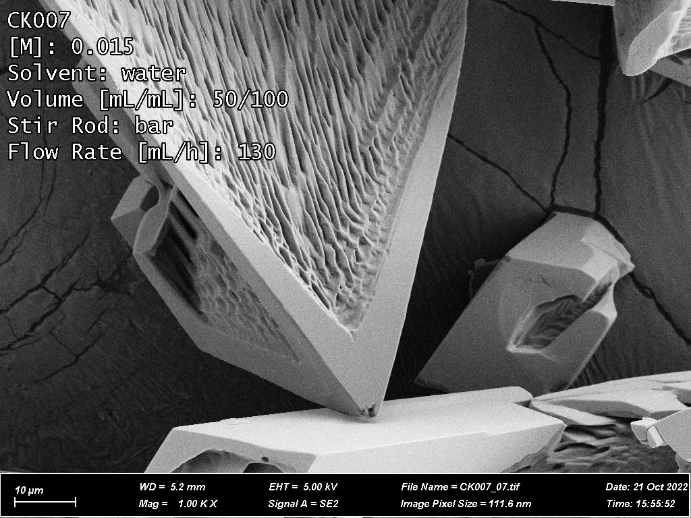

# Image Annotation Tool
A Python script for adding arbitrary text information to images based on their
filename and a CSV look-up table. Useful for batch annotation of systmatically
named images (e.g. from microscopy).

**For example**, given a look-up table containing the `sample` row, `CK007`:
| sample | [M]   | Solvent | Volume [mL/mL] | Stir Rod | Flow Rate [mL/h] |
|--------|-------|---------|----------------|----------|------------------|
| ...    | ...   | ...     | ...            | ...      | ...              |
| CK007  | 0.015 | water   | 50/100         | bar      | 130              |
| ...    | ...   | ...     | ...            | ...      | ...              |

The script will identify the input image, `CK007_07.png`, and add all of the
annotation columns ("[M]", "Solvent", etc.) to the upper left of the image as
below:


## Requirements
- Python 3.10+
- Pillow (the Python image library)
    - Install using `pip 

## Usage

1. Download (or Git clone) this repository. Extract the .zip if necessary.

1. Copy all images to be annotated into the `source_images` folder.

1. Fill out the `annotations.csv`
    -   The only requirement is that the first column be named "sample"
        - Each sample name should correspond to (part of) one image's filename
    -   All additional columns will be added to the image in the format:
        `"column heading": "row value"`. See the table/image above for example.
1. [Optional] Edit the `config.toml` file to adjust the font size, position, and
    stroke thickness.

1. Run the script using the termal:
    1. Using the `cd` command, navigate to the script directory in the terminal.
    1. Run the script using the following terminal command:

       ```py ./annotation.csv ./source_images ./annotated_images```
       
       This will output all annotated images to a sub-folder in
       `annotated_images/` with today's date and the current time.